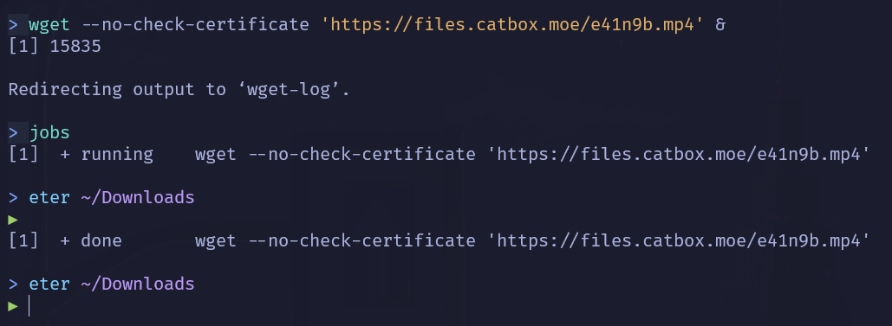

<div align=center>

# *Process* & Daemon

</div>

# Daftar Isi

- [*Process* \& Daemon](#process--daemon)
- [Daftar Isi](#daftar-isi)
  - [Proses](#proses)
    - [Macam-Macam PID](#macam-macam-pid)
    - [Melihat Proses Berjalan](#melihat-proses-berjalan)
    - [Menghentikan Proses](#menghentikan-proses)
    - [Membuat Proses](#membuat-proses)
    - [system](#system)
    - [Jenis-Jenis Proses](#jenis-jenis-proses)
  - [Daemon](#daemon)
    - [Pembuatan Daemon](#pembuatan-daemon)
    - [Implementasi Daemon](#implementasi-daemon)
  - [Extras](#extras)
    - [FILE Handling dalam C](#file-handling-dalam-c)
    - [Directory Listing dalam C](#directory-listing-dalam-c)
    - [File Permission dalam C](#file-permission-dalam-c)
    - [File Ownership dalam C](#file-ownership-dalam-c)
  - [Referensi](#referensi)

## Proses

Proses adalah program yang sedang dieksekusi oleh OS. Ketika suatu program tersebut dieksekusi oleh OS, proses tersebut memiliki PID (Process ID) yang merupakan identifier dari suatu proses. Pada UNIX, untuk melihat proses yang dieksekusi oleh OS dengan memanggil perintah shell `ps`. Untuk melihat lebih lanjut mengenai perintah `ps` dapat membuka `man ps`.

Dalam penggunaannya, suatu proses dapat membentuk proses lainnya yang disebut _spawning process_. Proses yang memanggil proses lainnya disebut **_parent process_** dan yang terpanggil disebut **_child process_**.

### Macam-Macam PID

**User ID (UID)**

Merupakan identifier dari suatu proses yang menampilkan user yang menjalankan suatu program. Pada program C, dapat memanggil fungsi `uid_t getuid(void);`

**Process ID (PID)**

Angka unik dari suatu proses yang sedang berjalan untuk mengidentifikasi suatu proses. Pada program C, dapat memanggil fungsi `pid_t getpid(void);`

**Parent PID (PPID)**

Setiap proses memiliki identifier tersendiri dan juga setelah proses tersebut membuat proses lainnya. Proses yang terbentuk ini memiliki identifier berupa ID dari pembuatnya (parent). Pada program C, dapat memanggil fungsi `pid_t getppid(void);`

### Melihat Proses Berjalan

Untuk melihat proces yang sedang berjalan di OS, dapat menggunakan `ps`.


atau jika ingin lebih jelas dan detail dapat menggunakan command `ps aux`.


perbedaan nya adalah jika hanya mengguanakan ps maka akan melihat proses hanya di user tersebut dan jika ps aux akan memperlihatkan semua proses yang berjalan meskipun di user lain.

Penjelasan:

- *UID*: user yang menjalankan program
- *PID*: process IDnya
- *PPID*: parent PID, kalau tidak ada parent akan bernilai 0
- *C*: CPU Util. (%)
- *STIME*: waktu proses dijalankan
- *TTY*: terminal yang menjalankan proses. Jika tidak ada berarti background
- *TIME*: lamanya proses berjalan
- *CMD*: perintah yang menjalankan proses tersebut

Kita juga dapat melihat proses yang berjalan dalam bentuk tree, sehingga kita dengan mudah mengidentifikasi mana yang merupakan child proses dan mana parent nya. Dengan mengguunakan command `pstree`


### Menghentikan Proses

[Daftar Isi](#daftar-isi)

Untuk menghentikan (_terminate_) proses yang berjalan, jalankan perintah shell `kill [options] <pid>`. Biasanya untuk menghentikan paksa suatu proses dapat menggunakan perintah `kill -9 <pid>`. Angka _9_ adalah kode Signal untuk terminate suatu process.

Selain menggunakan command `kill` kita juga dapat menggunakan command `pkill`. Perbedaan penggunaannya jika menggunakan pkill adalah dengan menambahkan nama prosesnya `pkill [options] <nama proses>`

Kalian dapat melihat PID dan Nama proses menggunakan `jobs -l` atau `ps aux`

**Macam-Macam Signal**

| Signal name | Signal value | Effect                  |
| ----------- | :----------: | ----------------------- |
| SIGHUP      |      1       | Hangup                  |
| SIGINT      |      2       | Interrupt from keyboard |
| SIGKILL     |      9       | Kill signal             |
| SIGTERM     |      15      | Termination signal      |
| SIGSTOP     |   17,19,23   | Stop the process        |

Secara default ketika menggunakan perintah shell `kill <pid>`, akan menggunakan `SIGTERM` yang mana akan menghentikan proses namun masih dapat dilanjutkan kembali.

Jika kita menggunakan `Ctrl + C` untuk menghentikkan suatu program, saat itu akan dikirimkan signal `SIGINT` yang mana proses akan dihentikan secara permanen oleh sistem.

Sedangkan jika kita menggunakan `Ctrl + Z` untuk menghentikan suatu program, saat itu sistem akan mengirimkan signal `SIGTSTP` (bukan SIGSTP) yang artinya menjeda proses tersebut dan dapat dijalankan kembali dengan menggunakan perintah `fg` atau `bg`.

### Membuat Proses

**fork**

`fork` adalah fungsi _system call_ di C untuk melakukan _spawning process_. Setelah memanggil fungsi itu, akan terdapat proses baru yang merupakan _child process_, fungsi akan mengembalikan nilai 0 di dalam _child process_, dan akan mengembalikan nilai _PID_ dari _child process_ di dalam _parent process_

Coba program dibawah ini dan compile terlebih dahulu dengan `gcc coba.c -o coba`

Kemudian execute program dengan `./coba`

Contoh program biasa tanpa menggunakan `fork()`

```c
#include <stdio.h>
#include <stdlib.h>

int main() {
    printf("Hello World!\n");
    return 0;
}
```

Contoh program dengan menggunakan `fork()`

```c
#include <stdio.h>
#include <sys/types.h>
#include <unistd.h>

int main(){
  pid_t child_id;

  child_id = fork();

  printf("Hello World\n");

  if(child_id != 0){
    printf("\nParent process.\nPID: %d, Child's PID: %d\n", (int)getpid(), (int)child_id);
  }else {
    printf("\nChild process.\nPID: %d, Parent's PID: %d\n", (int)getpid(), (int)getppid());
  }

  return 0;
}
```

Hasilnya akan menjadi:

```
Hello World

Parent process.
PID: 13101, Child's PID: 13102
Hello World

Child process.
PID: 13102, Parent's PID: 13101
```

Hello World terpanggil dua kali, karena terpanggil kembali pada proses baru dan dengan PID yang berbeda.

Visualisasi:

```c
+-------------------------+
|   Parent Process        |
+-------------------------+
|   int main() {          |
|     pid_t child_id;     |
|                         |
|     pid = getpid();     |
|     ppid = getppid();   |
|                         |
|-->  child_id = fork();  |
+-------------------------+
|    pid = 20             |
|    child_id = undefined |
|    ppid = 10            |
+-------------------------+
         |\
         | \----------------------------------\
         |                                     |
         V                                     V
+-------------------------+        +-------------------------+
|   Parent Process        |        |     Child Process       |
+-------------------------+        +-------------------------+
|-->                      |        |-->                      |
|     pid = getpid();     |        |     pid = getpid();     |
|     ppid = getppid();   |        |     ppid = getppid();   |
|   }                     |        |   }                     |
+-------------------------+        +-------------------------+
|    pid = 20             |        |    pid = 23             |
|    child_id = 23        |        |    child_id = 0         |
|    ppid = 10            |        |    ppid = 20            |
+-------------------------+        +-------------------------+
```

**exec**

`exec` adalah fungsi untuk menjalankan program baru dan menggantikan program yang sedang berjalan. Fungsi `exec` memiliki banyak variasi seperti `execvp`, `execlp`, dan `execv`.

Contoh yang akan digunakan adalah `execv`.

```c
#include <stdio.h>
#include <unistd.h>

int main () {

  // argv[n] = { {your-program-name}, {argument[1]}, {argument[2]},.....,{argument[n-2]}, NULL }

  char *argv[4] = {"ls", "-l", "/home/", NULL};

  execv("/bin/ls", argv);

  printf("This line will not be executed\n");

  return 0;

}
```

Perlu diperhatikan bahwa setelah pemanggilan `exec`, semua kode di bawahnya tidak akan dieksekusi karena program yang berjalan telah diganti oleh program baru, kecuali jika terjadi error.

**Menjalankan Program di latar belakang**

Dengan menggunakan `&` diakhir command kita dapat menjalankan program di latar belakang sehingga kita dapat melakukan hal lain sembari proses lain berjalan.

contoh implementasinya pada command wget dibawah:



Dengan demikian kita tidak harus menunggu dan tetap bisa menggunakan terminal untuk keperluan yang lain. Dan jika ingin melihat progres dari proses tersebut bisa menggunakan command `jobs`.

Dan ini jika kita menjalankannya di foreground:


Jika seperti ini maka proses akan berjalan secara foreground sehingga akan muncul di layar kalian.

**Menjalankan Program Secara Bersamaan**

Dengan menggabungkan `fork` dan `exec`, kita dapat melakukan dua atau lebih _tasks_ secara bersamaan. Contohnya adalah membackup log yang berbeda secara bersamaan.

```c
#include <stdlib.h>
#include <sys/types.h>
#include <unistd.h>

int main() {
  pid_t child_id;

  child_id = fork();

  if (child_id < 0) {
    exit(EXIT_FAILURE); // Jika gagal membuat proses baru, program akan berhenti
  }

  if (child_id == 0) {
    // this is child

    char *argv[] = {"cp", "/var/log/apt/history.log", "/home/[user]/", NULL};
    execv("/bin/cp", argv);
  } else {
    // this is parent

    char *argv[] = {"cp", "/var/log/dpkg.log", "/home/[user]/", NULL};
    execv("/bin/cp", argv);
  }
}
```

Visualisasi:

```c
+--------+
| pid=7  |
| ppid=4 |
| bash   |
+--------+
    |
    | calls fork
    V
+--------+                     +--------+
| pid=7  |    forks            | pid=22 |
| ppid=4 | ------------------> | ppid=7 |
| bash   |                     | bash   |
+--------+                     +--------+
    |                              |
    | calls exec to run cp         | calls exec to run cp
    |                              |
    V                              V
```

Jika ingin melakukan banyak task secara bersamaan tanpa mementingkan urutan kerjanya, dapat menggunakan `fork` dan `exec`.

**wait** x **fork** x **exec**

Kita dapat menjalankan dua proses dalam satu program. Contoh penggunaannya adalah membuat folder dan mengisi folder tersebut dengan suatu file. Pertama, buat folder terlebih dahulu. Kemudian, buat file dengan perintah shell `touch` pada folder tersebut. Namun, pada kenyataannya untuk melakukan dua hal bersamaan perlu adanya jeda beberapa saat.

Untuk membuat file yang berada dalam suatu folder, pertama-tama folder harus ada terlebih dahulu. Untuk _delay_ suatu proses dapat menggunakan _system call_ `wait`.

```c
#include <stdio.h>
#include <stdlib.h>
#include <unistd.h>
#include <sys/wait.h>

int main() {
    pid_t pid = fork();

    if (pid < 0) {
        printf("Error: Fork Failed\n");
        exit(1);
    }
    else if (pid == 0) {
        printf("Hello World from child process!\n");
        exit(0);
    }
    else {
        printf("Hello World from parent process!\n");
        int status;
        wait(&status);
        if (WIFEXITED(status)) {
            printf("Child process terminated normally with exit status: %d\n", WEXITSTATUS(status));
        }
        else {
            printf("Child process terminated abnormally\n");
        }
        exit(0);
    }
}
```

Pada contoh di atas, parent proses akan menunggu child proses selesai dijalankan dengan menggunakan `wait()` dan kemudian mengeluarkan pesan sesuai dengan status keluaran child proses menggunakan `WIFEXITED()` dan `WEXITSTATUS()`. Jika exit status = 0 menandakan program selesai dijalankan dengan benar.

Output Program:

```
Hello World from parent process!
Hello World from child process!
Child process terminated normally with exit status: 0
```

Contoh lain :

```c
#include <stdlib.h>
#include <sys/types.h>
#include <unistd.h>
#include <wait.h>

int main() {
  pid_t child_id;
  int status;

  child_id = fork();

  if (child_id < 0) {
    exit(EXIT_FAILURE); // Jika gagal membuat proses baru, program akan berhenti
  }

  if (child_id == 0) {
    // this is child

    char *argv[] = {"mkdir", "-p", "folderku", NULL};
    execv("/bin/mkdir", argv);
  } else {
    // this is parent
    while ((wait(&status)) > 0);
    char *argv[] = {"touch", "folderku/fileku.txt", NULL};
    execv("/usr/bin/touch", argv);
  }
}
```

Pada contoh di atas, fungsi `wait` adalah menunggu _child process_ selesai melakukan tugasnya, yaitu membuat folder. Setelah _terminated_, _parent process_ akan kembali menjalankan prosesnya membuat `fileku` dalam folder `folderku`.


### system

`system` adalah fungsi untuk melakukan pemanggilan perintah shell secara langsung dari program C. Contohnya ketika ingin memanggil suatu script dalam program C. `system("ls")` akan menghasilkan output yang sama ketika memanggilnya di shell script dengan `ls`.

File inibash.sh:

```sh
#!/bin/bash

echo "Shell script dipanggil"

```

File system.c:

```c
#include <stdlib.h>

int main() {
  int return_value;
  return_value = system("bash inibash.sh");
  return return_value;
}

```

Output:

```
Shell script dipanggil
```

Perhatikan bahwa fungsi `system()` mengeksekusi command melalui shell, sehingga kurang aman dibandingkan menggunakan `exec`. Penggunaan `system()` juga menyebabkan overhead performa karena harus membuat shell baru untuk menjalankan perintah.

### Jenis-Jenis Proses

**Zombie Process**

Zombie Process terjadi karena adanya child process yang di exit namun parent processnya tidak memanggil `wait()` untuk mendapatkan status exit dari child tersebut. Ini menyebabkan entry proses tetap ada di tabel proses sistem meskipun eksekusinya sudah selesai. Zombie process tidak menggunakan resource sistem kecuali entry dalam tabel proses, namun tetap tidak baik membiarkannya ada dalam jumlah banyak.

**Orphan Process**

Orphan Process adalah sebuah proses yang ada dalam komputer dimana parent process telah selesai atau berhenti bekerja namun proses anak sendiri tetap berjalan. Pada sistem Linux, orphan process biasanya "diadopsi" oleh proses init (PID 1), sehingga tidak benar-benar menjadi "yatim piatu".

**Daemon Process**

Daemon Process adalah sebuah proses yang bekerja pada background karena proses ini tidak memiliki terminal pengontrol. Dalam sistem operasi Windows biasanya lebih dikenal dengan sebutan service. Daemon adalah sebuah proses yang didesain supaya proses tersebut tidak mendapatkan intervensi dari user.

---

## Daemon

[Daftar Isi](#daftar-isi)

Daemon adalah suatu program yang berjalan di background secara terus menerus tanpa adanya interaksi secara langsung dengan user yang sedang aktif.

### Pembuatan Daemon

Ada beberapa langkah untuk membuat sebuah daemon:

**Melakukan Fork pada Parent Process dan mematikan Parent Process**

Langkah pertama adalah membuat sebuah parent process dan memunculkan child process dengan melakukan `fork()`. Kemudian bunuh parent process agar sistem operasi mengira bahwa proses telah selesai.

```c
pid_t pid;        // Variabel untuk menyimpan PID

pid = fork();     // Menyimpan PID dari Child Process

/* Keluar saat fork gagal
 * (nilai variabel pid < 0) */
if (pid < 0) {
  exit(EXIT_FAILURE);
}

/* Keluar saat fork berhasil
 * (nilai variabel pid adalah PID dari child process) */
if (pid > 0) {
  exit(EXIT_SUCCESS);
}
```

**Mengubah Mode File dengan `umask`**

Setiap file dan directory memiliki _permission_ atau izin yang mengatur siapa saja yang boleh melakukan _read, write,_ dan _execute_ pada file atau directory tersebut.

Dengan menggunakan `umask` kita dapat mengatur _permission_ dari suatu file pada saat file itu dibuat. Di sini kita mengatur nilai `umask(0)` agar kita mendapatkan akses full terhadap file yang dibuat oleh daemon.

```c
umask(0);
```

**Membuat Unique Session ID (SID)**

Sebuah Child Process harus memiliki SID agar dapat berjalan. Tanpa adanya SID, Child Process yang Parent-nya sudah di-`kill` akan menjadi Orphan Process.

Untuk mendapatkan SID kita dapat menggunakan perintah `setsid()`. Perintah tersebut memiliki _return type_ yang sama dengan perintah `fork()`.

```c
sid = setsid();
if (sid < 0) {
  exit(EXIT_FAILURE);
}
```

**Mengubah Working Directory**

Working directory harus diubah ke suatu directory yang pasti ada. Untuk amannya, kita akan mengubahnya ke root (/) directory karena itu adalah directory yang dijamin ada pada semua distro linux.

Untuk mengubah Working Directory, kita dapat menggunakan perintah `chdir()`.

```c
if ((chdir("/")) < 0) {
  exit(EXIT_FAILURE);
}
```

**Menutup File Descriptor Standar**

Sebuah daemon tidak boleh menggunakan terminal. Oleh sebab itu kita harus _menutup_ file descriptor standar (STDIN, STDOUT, STDERR).

```c
close(STDIN_FILENO);
close(STDOUT_FILENO);
close(STDERR_FILENO);
```

File descriptor sendiri merupakan sebuah angka yang merepresentasikan sabuah file yang dibuka di sebuah sistem operasi. File descriptor mendeskripsikan sumber data dan bagaimana data itu diakses.

**Membuat Loop Utama**

Di loop utama ini lah tempat kita menuliskan inti dari program kita. Jangan lupa beri perintah `sleep()` agar loop berjalan pada suatu interval dan tidak menghabiskan CPU.

```c
while (1) {
  // Tulis program kalian di sini

  sleep(30);
}
```

### Implementasi Daemon

Di bawah ini adalah kode hasil gabungan dari langkah-langkah pembuatan daemon (template Daemon):

```c
#include <sys/types.h>
#include <sys/stat.h>
#include <stdio.h>
#include <stdlib.h>
#include <fcntl.h>
#include <errno.h>
#include <unistd.h>
#include <syslog.h>
#include <string.h>

int main() {
  pid_t pid, sid;        // Variabel untuk menyimpan PID

  pid = fork();     // Menyimpan PID dari Child Process

  /* Keluar saat fork gagal
  * (nilai variabel pid < 0) */
  if (pid < 0) {
    exit(EXIT_FAILURE);
  }

  /* Keluar saat fork berhasil
  * (nilai variabel pid adalah PID dari child process) */
  if (pid > 0) {
    exit(EXIT_SUCCESS);
  }

  umask(0);

  sid = setsid();
  if (sid < 0) {
    exit(EXIT_FAILURE);
  }

  if ((chdir("/")) < 0) {
    exit(EXIT_FAILURE);
  }

  close(STDIN_FILENO);
  close(STDOUT_FILENO);
  close(STDERR_FILENO);

  while (1) {
    // Tulis program kalian di sini

    sleep(30);
  }
  
  return 0;
}
```

**Compile program daemon**

Untuk menjalankan daemon process pertama kita compile program C yang telah kita buat dengan perintah `gcc [nama_program.c] -o [nama_file_output]`.

**Menjalankan program daemon**

Setelah melakukan langkah sebelumnya, akan muncul sebuah file executable yang dapat dijalankan dengan `./nama_file_output`.

**Periksa apakah Daemon process berjalan**

Untuk memeriksa process apa saja yang sedang berlangsung kita dapat menggunakan perintah `ps -aux`. Untuk menemukan Daemon process yang kita _run_, manfaatkan `grep`. Sehingga perintahnya menjadi `ps -aux | grep "nama_file_output"`. Bila ada, berarti daemon process kita sedang berjalan.

**Mematikan Daemon process yang sedang berjalan**

Untuk mematikan daemon process kita akan menggunakan perintah `kill`. Pertama kita harus menemukan PID dari Daemon process yang akan dimatikan. Kita dapat menemukan PID tersebut pada langkah sebelumnya. Lalu jalankan `sudo kill -9 pid` untuk mematikan process-nya.

## Extras

### FILE Handling dalam C

Di bahasa C, kita dapat melakukan operasi create, open, read, write, dan close pada suatu file. Cara melakukan akses pada suatu file di bahasa C yaitu dengan memakai **file pointer**:

```c
FILE* fptr;
```

Kemudian untuk operasi-operasi yang dilakukan dengan adanya file pointer yaitu sebagai berikut:

**Open**


```c
// Syntax
// FILE* fopen(const char *file_name, const char *access_mode);
fptr = fopen("filename.txt", "r");
```

Di contoh ini, file **filename.txt** dibuka dan masuk ke file pointer **fptr**, yang dibuka dengan mode read (r). Terdapat beberapa mode-mode yang bisa dipakai saat membuka file:
v
| Mode | Deskripsi |
|------|-----------|
| r | Membuka file untuk dibaca. Jika file tidak ada, `fopen()` mengembalikan NULL. |
| rb | Membuka file dalam mode biner untuk dibaca. Jika file tidak ada, mengembalikan NULL. |
| w | Membuka file untuk ditulis. Jika file ada, isinya akan ditimpa. Jika tidak ada, file baru dibuat. |
| wb | Membuka file dalam mode biner untuk ditulis. Menimpa jika ada, membuat baru jika tidak ada. |
| a | Membuka file untuk ditambahkan (append). Data ditambahkan di akhir file. Membuat file baru jika tidak ada. |
| ab | Membuka file dalam mode biner untuk ditambahkan. Membuat file baru jika tidak ada. |
| r+ | Membuka file untuk dibaca dan ditulis. File harus sudah ada. |
| rb+ | Membuka file dalam mode biner untuk dibaca dan ditulis. File harus sudah ada. |
| w+ | Membuka file untuk dibaca dan ditulis. Menimpa file jika ada, membuat baru jika tidak ada. |
| wb+ | Membuka file dalam mode biner untuk dibaca dan ditulis. Menimpa jika ada, membuat baru jika tidak ada. |
| a+ | Membuka file untuk dibaca dan ditambahkan. Membuat file baru jika tidak ada. |
| ab+ | Membuka file dalam mode biner untuk dibaca dan ditambahkan. Membuat file baru jika tidak ada. |


**Create**

```c
fptr = fopen("filename.txt", "w");
```

**Read**

Ada beberapa cara untuk membaca isi file dalam bahasa C:

1. Membaca per karakter dengan `fgetc()`:
```c
FILE* fptr;
char c;

fptr = fopen("filename.txt", "r");
if (fptr == NULL) {
    printf("Error opening file!\n");
    exit(1);
}

// Membaca karakter satu per satu sampai akhir file
while ((c = fgetc(fptr)) != EOF) {
    printf("%c", c);
}

fclose(fptr);
```

2. Membaca per baris dengan `fgets()`:
```c
FILE* fptr;
char buffer[1024];

fptr = fopen("filename.txt", "r");
if (fptr == NULL) {
    printf("Error opening file!\n");
    exit(1);
}

// Membaca baris satu per satu
while (fgets(buffer, sizeof(buffer), fptr)) {
    printf("%s", buffer);
}

fclose(fptr);
```

3. Membaca data terformat dengan `fscanf()`:
```c
FILE* fptr;
int num;
char name[50];

fptr = fopen("data.txt", "r"); // Anggap file berisi: "1 John\n2 Jane"
if (fptr == NULL) {
    printf("Error opening file!\n");
    exit(1);
}

// Membaca data terformat
while (fscanf(fptr, "%d %s", &num, name) == 2) {
    printf("Num: %d, Name: %s\n", num, name);
}

fclose(fptr);
```

**Write**

Untuk menulis ke dalam file, kita dapat menggunakan beberapa fungsi:

1. Menulis per karakter dengan `fputc()`:
```c
FILE* fptr;
char c = 'A';

fptr = fopen("output.txt", "w");
if (fptr == NULL) {
    printf("Error opening file!\n");
    exit(1);
}

fputc(c, fptr); // Menulis karakter 'A' ke file

fclose(fptr);
```

2. Menulis string dengan `fputs()`:
```c
FILE* fptr;
char text[] = "Hello, World!";

fptr = fopen("output.txt", "w");
if (fptr == NULL) {
    printf("Error opening file!\n");
    exit(1);
}

fputs(text, fptr); // Menulis string ke file

fclose(fptr);
```

3. Menulis data terformat dengan `fprintf()`:
```c
FILE* fptr;
int id = 1;
char name[] = "John";

fptr = fopen("output.txt", "w");
if (fptr == NULL) {
    printf("Error opening file!\n");
    exit(1);
}

fprintf(fptr, "ID: %d, Name: %s\n", id, name); // Menulis data terformat ke file

fclose(fptr);
```

**Close**

Setelah selesai menggunakan file, penting untuk menutupnya dengan fungsi `fclose()`:

```c
fclose(fptr);
```

Menutup file setelah digunakan sangat penting karena:
1. Memastikan semua data telah ditulis ke disk
2. Membebaskan sumber daya sistem
3. Memungkinkan program lain mengakses file tersebut
4. Mencegah kebocoran memori (memory leak)

**Contoh Lengkap Program File Handling**

Berikut adalah contoh program yang menggabungkan proses membuka, menulis, membaca, dan menutup file:

```c
#include <stdio.h>
#include <stdlib.h>

int main() {
    FILE* fptr;
    char buffer[100];
    
    // Menulis ke file
    fptr = fopen("example.txt", "w");
    if (fptr == NULL) {
        printf("Error opening file for writing!\n");
        return 1;
    }
    
    fprintf(fptr, "Baris pertama.\n");
    fprintf(fptr, "Baris kedua dengan angka %d.\n", 42);
    fclose(fptr);
    
    // Membaca dari file
    fptr = fopen("example.txt", "r");
    if (fptr == NULL) {
        printf("Error opening file for reading!\n");
        return 1;
    }
    
    printf("Isi file example.txt:\n");
    while (fgets(buffer, sizeof(buffer), fptr)) {
        printf("%s", buffer);
    }
    
    fclose(fptr);
    
    return 0;
}
```

Contoh output program di atas:
```
Isi file example.txt:
Baris pertama.
Baris kedua dengan angka 42.
```

### Directory Listing dalam C

Dengan bahasa C, kita bisa melihat ada file apa saja yang terdapat dalam suatu directory. Hal ini membutuhkan library khusus bernama `dirent.h`. Berikut contoh directory listing di bahasa C:

```c
#include <stdio.h>
#include <sys/types.h>
#include <dirent.h>
#include <string.h>
#include <errno.h>

int main(void)
{
    DIR *dp;
    struct dirent *ep;
    char path[100];

    // Allow user to enter a directory path
    printf("Enter path to list files (default: \"thisdir\"): ");
    if (fgets(path, sizeof(path), stdin) == NULL) {
        perror("Error reading input");
        return 1;
    }

    // Remove trailing newline if present
    size_t len = strlen(path);
    if (len > 0 && path[len - 1] == '\n') {
        path[len - 1] = '\0';
    }

    // If no path was entered, use the default
    if (strlen(path) == 0) {
        strcpy(path, "thisdir");
    }

    dp = opendir(path);

    if (dp != NULL) {
        printf("Contents of directory '%s':\n", path);
        while ((ep = readdir(dp))) {
            printf("- %s\n", ep->d_name);
        }

        closedir(dp);
    } else {
        fprintf(stderr, "Couldn't open directory '%s': %s\n", path, strerror(errno));
        return 1;
    }

    return 0;
}
```

Kita juga bisa melakukan traverse secara rekursif terhadap suatu directory. Contoh:

```c
#include <stdio.h>
#include <string.h>
#include <dirent.h>
#include <errno.h>
#include <stdlib.h>

void listFilesRecursively(char *path, int depth);

int main()
{
    char path[100];

    // Allow user to enter a directory path
    printf("Enter path to list files recursively (default: \"thisdir\"): ");
    if (fgets(path, sizeof(path), stdin) == NULL) {
        perror("Error reading input");
        return 1;
    }

    // Remove trailing newline if present
    size_t len = strlen(path);
    if (len > 0 && path[len - 1] == '\n') {
        path[len - 1] = '\0';
    }

    // If no path was entered, use the default
    if (strlen(path) == 0) {
        strcpy(path, "thisdir");
    }

    printf("Recursive listing of directory '%s':\n", path);
    listFilesRecursively(path, 0);

    return 0;
}

// Recursively list files with indentation based on depth
void listFilesRecursively(char *basePath, int depth)
{
    char path[1000];
    struct dirent *dp;
    DIR *dir = opendir(basePath);

    if (!dir) {
        fprintf(stderr, "Cannot open directory '%s': %s\n", basePath, strerror(errno));
        return;
    }

    while ((dp = readdir(dir)) != NULL)
    {
        if (strcmp(dp->d_name, ".") != 0 && strcmp(dp->d_name, "..") != 0)
        {
            // Print indentation based on depth
            for (int i = 0; i < depth; i++) {
                printf("  ");
            }
            
            printf("|-- %s\n", dp->d_name);

            // Construct new path
            snprintf(path, sizeof(path), "%s/%s", basePath, dp->d_name);
            
            // Recursively list subdirectories
            listFilesRecursively(path, depth + 1);
        }
    }

    closedir(dir);
}
```

### File Permission dalam C

Kita bisa melihat permission dari suatu file atau directory di bahasa C dengan library `sys/stat.h`. Berikut adalah contoh dari checking permission file dengan bahasa C:

```c
#include <stdio.h>
#include <stdlib.h>
#include <sys/stat.h>
#include <string.h>
#include <errno.h>

int main()
{
    struct stat fs;
    char filename[100];
    int r;

    printf("Enter path to check file permissions: ");
    if (scanf("%99s", filename) != 1) {
        fprintf(stderr, "Error reading input\n");
        return EXIT_FAILURE;
    }

    r = stat(filename, &fs);
    if (r == -1) {
        fprintf(stderr, "Error accessing '%s': %s\n", filename, strerror(errno));
        return EXIT_FAILURE;
    }

    printf("\nObtaining permission mode for '%s':\n", filename);

    printf("File type: ");
    if (S_ISREG(fs.st_mode))
        printf("Regular file\n");
    else if (S_ISDIR(fs.st_mode))
        printf("Directory\n");
    else if (S_ISLNK(fs.st_mode))
        printf("Symbolic link\n");
    else
        printf("Other\n");

    printf("Owner permissions: ");
    if (fs.st_mode & S_IRUSR)
        printf("read ");
    if (fs.st_mode & S_IWUSR)
        printf("write ");
    if (fs.st_mode & S_IXUSR)
        printf("execute");
    putchar('\n');

    printf("Group permissions: ");
    if (fs.st_mode & S_IRGRP)
        printf("read ");
    if (fs.st_mode & S_IWGRP)
        printf("write ");
    if (fs.st_mode & S_IXGRP)
        printf("execute");
    putchar('\n');

    printf("Others permissions: ");
    if (fs.st_mode & S_IROTH)
        printf("read ");
    if (fs.st_mode & S_IWOTH)
        printf("write ");
    if (fs.st_mode & S_IXOTH)
        printf("execute");
    putchar('\n');

    // Print numeric mode
    printf("Numeric mode: %o\n", fs.st_mode & 0777);

    return EXIT_SUCCESS;
}
```

Untuk variabel dengan prefix `S_...` memiliki suatu aturan seperti file permission di dalam Linux. Berikut adalah gambar yang menunjukkan cara penggunaannya:


### File Ownership dalam C

Kita juga bisa melihat owner dan group dari suatu file dengan bahasa C. Hal ini bisa dilakukan dengan bantuan library `sys/stat.h`, `pwd.h`, dan `grp.h`. Untuk mendapatkan informasi itu, perlu dilakukan 2 langkah yaitu mencari UID dan GID dari suatu file lalu mencari nama dari user dan group dalam user database atau group database. Berikut adalah contoh cara melakukan hal tersebut:

```c
#include <stdio.h>
#include <stdlib.h>
#include <pwd.h>
#include <grp.h>
#include <sys/stat.h>
#include <string.h>
#include <errno.h>

int main()
{
    struct stat info;
    char path[100];
    int r;

    printf("Enter path to check file ownership: ");
    if (scanf("%99s", path) != 1) {
        fprintf(stderr, "Error reading input\n");
        return EXIT_FAILURE;
    }

    r = stat(path, &info);
    if (r == -1) {
        fprintf(stderr, "Error accessing '%s': %s\n", path, strerror(errno));
        return EXIT_FAILURE;
    }

    struct passwd *pw = getpwuid(info.st_uid);
    struct group *gr = getgrgid(info.st_gid);

    printf("\nFile ownership for '%s':\n", path);
    
    if (pw != NULL) {
        printf("Owner: %s (UID: %d)\n", pw->pw_name, (int)info.st_uid);
    } else {
        printf("Owner: Unknown (UID: %d)\n", (int)info.st_uid);
    }
    
    if (gr != NULL) {
        printf("Group: %s (GID: %d)\n", gr->gr_name, (int)info.st_gid);
    } else {
        printf("Group: Unknown (GID: %d)\n", (int)info.st_gid);
    }

    return EXIT_SUCCESS;
}
```

## Referensi

- https://notes.shichao.io/apue/ch8/
- https://www.geeksforgeeks.org/exec-family-of-functions-in-c/
- http://www.netzmafia.de/skripten/unix/linux-daemon-howto.html
- https://www.computerhope.com/unix/uumask.htm
- http://www.gnu.org/savannah-checkouts/gnu/libc/manual/html_node/Simple-Directory-Lister.html
- https://codeforwin.org/2018/03/c-program-to-list-all-files-in-a-directory-recursively.html
- https://c-for-dummies.com/blog/?p=4101
- https://pubs.opengroup.org/onlinepubs/009695399/functions/getgrgid.html
- https://pubs.opengroup.org/onlinepubs/009695399/functions/getgrgid.html
- https://pubs.opengroup.org/onlinepubs/009695399/functions/getpwuid.html
- https://www.geeksforgeeks.org/exit-status-child-process-linux/
- https://www.geeksforgeeks.org/basics-file-handling-c/