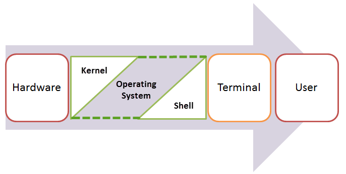
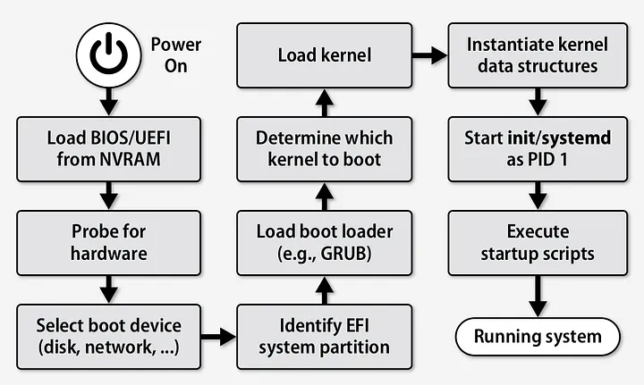
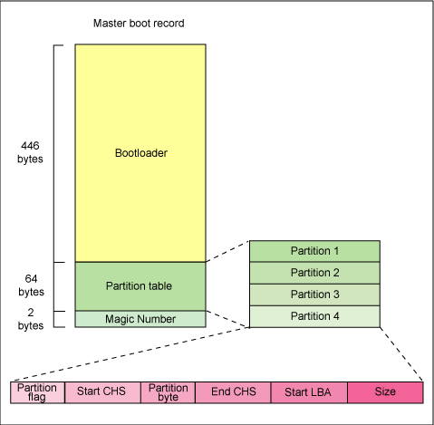
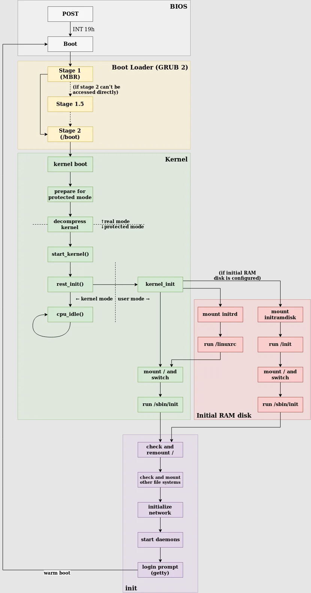
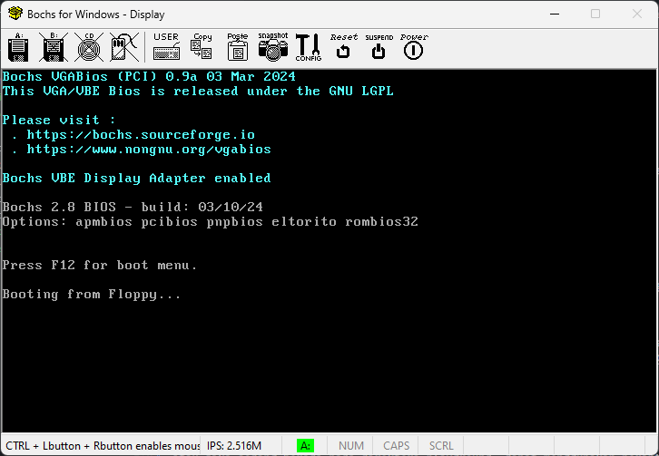
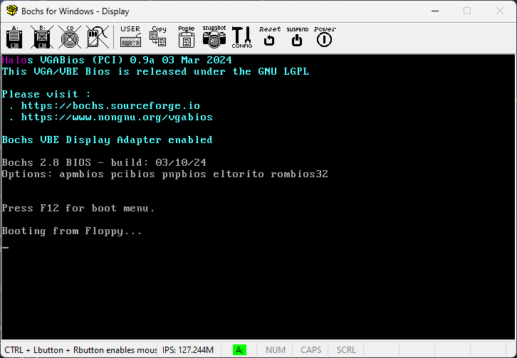

<div align=center>

# Operating System

</div>

## Objectives

1. Peserta memahami teori dalam sistem operasi
2. Peserta memahami langkah pembuatan sistem operasi secara dasar
3. Peserta memahami fitur-fitur yang penting dalam sistem operasi

## Daftar Isi


## Sistem Operasi

### Pengertian Sistem Operasi

Sistem operasi adalah satu kesatuan perangkat yang melakukan kontrol pada perangkat komputer dan sumber daya yang dimilikinya. Komponen dari sistem operasi dapat diilustrasikan pada diagram berikut.



- **Hardware**: Merupakan perangkat keras yang digunakan oleh sistem operasi untuk menjalankan program.
- **Kernel**: Merupakan inti dari sistem operasi yang mengatur sumber daya dan menjalankan program.
- **Shell**: Merupakan antarmuka yang digunakan oleh pengguna untuk berinteraksi dengan sistem operasi.
- **Application**: Merupakan program yang dijalankan oleh sistem operasi melalui shell yang terhubung dengan kernel.

### Pengertian Kernel

Kernel adalah bagian dari sistem operasi yang tidak terlihat secara langsung, baik dalam perangkat keras maupun perangkat lunak komputer. Kernel menangani _event_ yang datang dari perangkat keras (_interrupts_) dan dari perangkat lunak (_system calls_), serta mengatur akses ke sumber daya komputer.

Contoh manajemen _event_ dari perangkat keras (_interrupt handlers_) adalah penekanan tombol pada keyboard yang kemudian akan diterjemahkan ke dalam simbol karakter bersesuaian pada buffer input. Kemudian program akan dapat mengambil karakter tersebut dari buffer input.

Sedangkan _system calls_ akan diakses oleh program, seperti membuka file, menjalankan program lain, dan sebagainya. Setiap _system call handler_ akan melakukan pengecekan kevalidan argumen yang diberikan dan kemudian melanjutkan perintah yang diberikan.

Program pada umumnya tidak akan langsung memanggil _system calls_ secara langsung, melainkan menggunakan _standard library_ untuk pemanggilannya. _Standard library_ tersebut yang nantinya akan menerjemahkan fungsi yang telah diberikan menjadi bentuk _system calls_ yang sesuai dengan apa yang dibutuhkan oleh kernel. Contohnya adalah fungsi `fopen()` pada bahasa C yang akan melakukan pemanggilan _system calls_ untuk membuka file.

Kernel bertugas untuk mengabstraksi perintah berkaitan seperti file, proses, socket, direktori, memory, dan lainnya.

### Pengertian Shell

Shell merupakan program yang biasanya terintegrasi dengan distribusi dari sistem operasi. Shell berguna sebagai antarmuka antara pengguna dengan sistem operasi. Bentuk dari shell dapat berbeda dari satu sistem operasi ke sistem operasi lainnya. Shell dapat berupa _command line interface_ (CLI) atau _graphical user interface_ (GUI).

Konsep utama dari shell adalah sebagai berikut.

- User dapat membuka program untuk dijalankan dan dapat juga memberikan argumen pada program tersebut.
- Mengizinkan user untuk melakukan operasi pada penyimpanan lokal, seperti melakukan _copy_, _move_, _delete_, dan lainnya.

Untuk melakukan tugas tersebut, shell akan memanggil beberapa _system calls_ yang akan dilanjutkan pada kernel.

### Proses Booting Sistem Operasi

Proses booting sistem operasi adalah proses dimana sistem operasi dijalankan dari keadaan mati hingga siap digunakan oleh pengguna. Secara sederhana, berikut adalah proses booting sistem operasi.



#### Basic Input Output System (BIOS)

BIOS terdiri dari beberapa intruksi yang ditulis dalam bahasa pemrograman yang sangat _low level_. BIOS adalah program pertama yang diinstall pada komputer, bahkan sebelum sistem operasi. Ketika komputer dinyalakan, CPU akan memerintahkan BIOS untuk melakukan pengecekan pada perangkat keras dasar komputer apakah telah siap untuk digunakan atau tidak. Proses ini dinamakan **Power of Self Test** (POST). Beberapa komponen yang dicek pada POST adalah sebagai berikut.

- Perangkat keras, seperti prosesor, penyimpanan, dan juga memory.
- Perangkat input/output, seperti keyboard, mouse, dan monitor.
- Register dari CPU.
- Interrupt Controller

Setelah POST selesai dijalankan, akan dilanjutkan dengan proses booting sistem operasi. Proses booting dari storage dengan memuat sektor pertama ke memory disebut dengan **Master Boot Record** (MBR).

#### Master Boot Record (MBR)

MBR adalah sektor pertama dari sistem penyimpanan (disk/storage). Tempat fisik dari MBR terdapat pada _cylinder_ 0, _head_ 0, dan _sector_ 1. MBR menyimpan informasi tabel partisi dan juga bootloader. Bootloader adalah program yang bertugas untuk memuat sistem operasi ke dalam memory. Ukuran dari MBR adalah 512 bytes. Pada 466 bytes pertama berisi bootloader, 64 bytes berikutnya berisi tabel partisi yang terdiri dari 4 partisi masing-masing 16 bytes. Kemudian pada 2 bytes terakhir, MBR berisi _magic number_ (`0xAA55`). _Magic number_ ini digunakan untuk menandakan bahwa MBR tersebut valid.



Tugas dari MBR adalah mencari bootloader kedua pada tabel partisi. Setelah menemukan bootloader kedua, MBR akan memuat bootloader kedua tersebut ke dalam memory dan akan dieksekusi.

#### Kernel Loader

Bootloader kedua yang dimuat oleh MBR adalah kernel loader. Kernel loader bertugas untuk memuat kernel dari sistem operasi ke dalam memory. Kernel loader akan memuat kernel ke dalam memory dan akan menjalankan kernel tersebut.

Pada linux, kernel loader yang digunakan adalah GRUB (Grand Unified Bootloader). GRUB adalah bootloader yang bersifat open source dan dapat digunakan pada berbagai sistem operasi. GRUB memiliki beberapa fitur yang berguna, seperti _multiboot_, _multiboot2_, dan _chainloading_.

Hal tersebut dilakukan karena pada kernel loader modern seperti GRUB, tidak cukup jika dimasukkan kedalam 466 bytes di MBR. Sehingga MBR perlu mencari bootloader kedua yang akan memuat kernel ke dalam memory.

Berikut adalah ilustrasi dari proses booting sistem operasi linux.



### Pengertian Interrupts

Interrupts adalah mekanisme yang digunakan oleh CPU untuk memberitahu bahwa ada _event_ yang terjadi. Interrupts digunakan untuk menghentikan eksekusi program yang sedang berjalan dan menjalankan _interrupt handler_ yang sesuai dengan _event_ yang terjadi.

_Interrupt handler_ atau _Interrupt Service Routine_ (ISR) dapat dianalogikan dengan _event listener_ pada _event-driven programming_ yang umumnya digunakan pada bahasa pemrograman _high-level_ seperti javascript. ISR adalah _event handler_ untuk interrupts yang terjadi. Setiap interrupt memiliki kode terkait yang menandakan _event_ yang terjadi. Kode ini disebut dengan _interrupt vector_. Instruksi untuk interrupt pada x86 adalah `int n` dimana `n` adalah vector dari interrupt. Vector interrupt dapat dituliskan dalam notasi heksadesimal (0x00 - 0xFF) atau notasi vector (00h - FFh).

Penjelasan lebih lanjut mengenai interrupts dapat dilihat [di sini](https://en.wikipedia.org/wiki/BIOS_interrupt_call).

Impelementasi interrupts yang akan digunakan pada praktikum adalah service `int 21h` yang digunakan untuk melakukan _interrupt_ pada kernel DOS. Dengan melakukan pemanggilan `int 21h` menggunakan parameter tertentu (seperti AH dan AL), kita dapat melakukan berbagai akses input output pada sistem operasi DOS.

## Pembuatan Sistem Operasi Sederhana

### Instalasi Tools

Untuk membuat sistem operasi sederhana, kita memerlukan beberapa tools yang akan digunakan. Berikut adalah tools yang diperlukan.

- **Bochs**: Bochs adalah emulator x86 yang digunakan untuk menjalankan sistem operasi yang dibuat. Bochs dapat dijalankan pada berbagai sistem operasi, seperti Windows, MacOS, dan Linux.

  Bochs dapat diunduh pada [web resmi bochs](https://bochs.sourceforge.io/) atau pada rilis github [berikut](https://github.com/bochs-emu/Bochs/releases/tag/REL_2_8_FINAL). Sesuaikan dengan sistem operasi yang kalian gunakan. **Sangat disarankan mengunduh bochs versi terbaru melalui website, bukan menggunakan apt.**

- **NASM**: NASM adalah assembler yang digunakan untuk mengubah kode assembly menjadi kode biner. NASM dapat diunduh pada [web resmi NASM](https://www.nasm.us/) atau dapat menggunakan perintah berikut.

  ```bash
  sudo apt install nasm
  ```

- **BCC**: BCC adalah compiler C yang digunakan untuk melakukan kompilasi kode C menjadi 16 bit (GCC tidak dapat digunakan karena GCC menghasilkan kode 32 bit). Dokumentasi BCC dapat diakses [di sini](https://linux.die.net/man/1/bcc) dan dapat diunduh menggunakan perintah berikut.

  ```bash
  sudo apt install bcc
  ```

- **ld86**: ld86 adalah linker yang digunakan untuk menggabungkan _object kode_ dari kode assembly dan kode C menjadi sebuah _executable_.

  ```bash
  sudo apt install bin86
  ```

- **make**: Make adalah _build automation tool_ yang digunakan untuk mempermudah proses kompilasi kode. Make dapat diunduh menggunakan perintah berikut.

  ```bash
  sudo apt install make
  ```

### Persiapan Disk Image

Sistem operasi akan disimpan pada sebuah disk image. Disk image adalah file yang berisi data yang akan digunakan oleh sistem operasi. Disk image akan digunakan oleh emulator untuk menyimpan sistem operasi yang akan dijalankan. Kali ini, akan digunakan disk image dengan ukuran 1.44 MB (ukuran floppy disk). Disk image dapat dibuat menggunakan perintah berikut.

```bash
dd if=/dev/zero of=floppy.img bs=512 count=2880
```

- `if=/dev/zero` `(input file = /dev/zero)`: Membaca dari `/dev/zero` yang berisi byte 0.
- `of=floppy.img` `(output file = floppy.img)`: Menulis ke `floppy.img`.
- `bs=512` `(block size = 512)`: Mengatur ukuran blok sebesar 512 byte.
- `count=2880`: Mengatur jumlah blok sebanyak 2880 blok (ukuran floppy disk).

### Bootloader Sederhana

Sebelum masuk ke pembuatan bootloader yang memanggil kernel, kita akan membuat bootloader sederhana yang hanya menampilkan layar hitam. Berikut adalah kode bootloader sederhana.

```asm
; simple-bootloader.asm
bits 16

times 510 - ($-$$) db 0x00
dw 0xAA55
```

- `bits 16`: Menandakan bahwa kode ini adalah kode 16 bit.

- `times 510 - ($-$$) db 0x00`: Mengisi bagian yang kosong pada MBR dengan 0x00

  510 bytes dikurangi dengan ukuran kode `($-$$)` diisi dengan 0x00

- `dw 0xAA55`: Menandakan bahwa MBR yang dibuat adalah valid.

  2 bytes terakhir diisi dengan 0xAA55

Setelah itu, kode di atas dapat dicompile menggunakan perintah berikut.

```bash
nasm -f bin simple-bootloader.asm -o simple-bootloader.bin
```

- `-f bin` `(format binary)`: Mengubah kode assembly menjadi kode biner.

Selanjutnya, kode binary yang dihasilkan akan digabungkan dengan disk image yang telah dibuat sebelumnya menggunakan perintah berikut.

```bash
dd if=simple-bootloader.bin of=floppy.img bs=512 count=1 conv=notrunc
```

- `count=1`: Menulis sebanyak 1 blok (sesuai ukuran MBR 512 bytes).
- `conv=notrunc` `(convert = notruncate)`: Menulis ke `floppy.img` tanpa menghapus data yang sudah ada.

### Menjalankan Bootloader Sederhana

Setelah membuat bootloader sederhana, kita akan menjalankan bootloader tersebut menggunakan emulator Bochs. Dapat digunakan konfigurasi pada playground [`bochsrc.txt`](./playground/bochsrc.txt). Kemudian dapat dijalankan menggunakan perintah berikut.

```bash
bochs -f bochsrc.txt
```

atau jika sedang berada pada direktori playground, dapat menggunakan perintah berikut.

```bash
bochs
```

Setelah dijalankan akan muncul tampilan seperti berikut.



### Membuat Kernel Assembly

Setelah membuat bootloader, kita akan membuat kernel yang nanti akan dipanggil oleh bootloader. Berikut adalah kode kernel.

```asm
; kernel.asm
global _putInMemory

; void putInMemory(int segment, int address, char character)
_putInMemory:
	push bp
	mov bp,sp
	push ds
	mov ax,[bp+4]
	mov si,[bp+6]
	mov cl,[bp+8]
	mov ds,ax
	mov [si],cl
	pop ds
	pop bp
	ret
```

- `global _putInMemory`: Mendeklarasikan fungsi `_putInMemory` sebagai fungsi global yang nantinya akan bisa dipanggil melalui kode C.

- `_putInMemory`: Implementasi fungsi `_putInMemory`.

  Inti dari fungsi ini adalah untuk memasukkan karakter ke dalam memory. Fungsi ini akan menerima 3 argumen, yaitu segment, address, dan character. Segment dan address digunakan untuk menentukan alamat memory yang akan diisi dengan karakter yang diberikan.

  Fungsi ini dibuat karena alamat memory yang akan diisi dapat melebihi 16 bit. Sedangkan register pada x86 hanya memiliki 16 bit. Sehingga kita memerlukan segment dan address untuk menentukan alamat memory yang akan diisi.

Setelah itu, kode di atas dapat dicompile menggunakan perintah berikut.

```bash
nasm -f as86 kernel.asm -o kernel-asm.o
```

- `-f as86` `(format as86)`: Mengubah kode assembly menjadi kode objek.

### Membuat Kernel C

Setelah membuat kernel assembly, kita akan membuat kernel C yang akan memanggil fungsi `_putInMemory` yang telah dibuat sebelumnya. Berikut adalah kode kernel C.

```c
// kernel.c
void main() {
  char* str = "Halo";
  int i = 0;

  for (i = 0; i < 4; i++) {
    char warna = 0x5;
    putInMemory(0xB000, 0x8000 + i * 2, str[i]);
    putInMemory(0xB000, 0x8001 + i * 2, warna);
  }

  while (1);
}
```

- `void main()`: Fungsi utama dari kernel.

- `0xB8000` adalah alamat memory untuk video memory pada VGA. Alamat ini digunakan untuk menampilkan karakter pada kiri atas layar pada posisi `(0, 0)`.

- Karena `0xB8000` tidak dapat ditampung dalam 16 bit (2 bytes), maka kita membagi alamat tersebut menjadi 2 bagian, yaitu segment dan address. Segment adalah `0xB000` dan address adalah `0x8000`. Operasi yang akan dilakukan fungsi `_putInMemory` pada assembly adalah menggabungkan kedua alamat tersebut menjadi alamat memory yang valid.

- Offset untuk karakter adalah `0x8000 + i * 2` dan offset untuk warna adalah `0x8001 + i * 2`. Offset ini digunakan untuk menampilkan karakter dan warna pada layar.

- Pada umumnya, offset karakter pada `(x,y)` adalah `0x8000 + (y * 80 + x) * 2`.

- Sedangkan, offset warna pada `(x,y)` adalah `0x8001 + (y * 80 + x) * 2`.

- `while (1)`: _Infinite loop_ agar program tidak berhenti setelah menampilkan karakter.

Setelah itu, kode di atas dapat dicompile menggunakan perintah berikut.

```bash
bcc -ansi -c kernel.c -o kernel.o
```

- `-ansi`: Menggunakan standar ANSI C.
- `-c`: Menghasilkan _object file_.
- `-o kernel.o`: Menyimpan hasil kompilasi ke dalam file `kernel.o`.

### Menggabungkan Kernel Assembly dan Kernel C

Setelah membuat kernel assembly dan kernel C, kita akan menggabungkan kedua _object file_ tersebut menjadi sebuah _executable_. Berikut adalah perintah yang digunakan.

```bash
ld86 -o kernel.bin -d kernel.o kernel-asm.o
```

- `-o kernel`: Menyimpan hasil _linking_ ke dalam file `kernel`.

- `-d`: Menghapus header dari _output file_ yang mengharuskan urutan deklarasi fungsi harus urut.

- `kernel.o kernel-asm.o`: _Object file_ yang akan digabungkan.

### Mengubah Bootloader

Setelah membuat kernel, kita akan mengubah bootloader yang telah dibuat sebelumnya agar dapat memanggil kernel yang telah dibuat. Berikut adalah kode bootloader yang telah diubah.

```asm
; bootloader.asm
bits 16

KERNEL_SEGMENT equ 0x1000 ; kernel will be loaded at 0x1000:0x0000
KERNEL_SECTORS equ 15     ; kernel will be loaded in 15 sectors maximum
KERNEL_START   equ 1      ; kernel will be loaded in sector 1

; bootloader code
bootloader:
  ; load kernel to memory
  mov ax, KERNEL_SEGMENT    ; load address of kernel
  mov es, ax                ; buffer address are in ES:BX
  mov bx, 0x0000            ; set buffer address to KERNEL_SEGMENT:0x0000

  mov ah, 0x02              ; read disk sectors
  mov al, KERNEL_SECTORS    ; number of sectors to read

  mov ch, 0x00              ; cylinder number
  mov cl, KERNEL_START + 1  ; sector number
  mov dh, 0x00              ; head number
  mov dl, 0x00              ; read from drive A

  int 0x13                  ; call BIOS interrupts

  ; set up segment registers
  mov ax, KERNEL_SEGMENT
  mov ds, ax
  mov es, ax
  mov ss, ax

  ; set up stack pointer
  mov ax, 0xFFF0
  mov sp, ax
  mov bp, ax

  ; jump to kernel
  jmp KERNEL_SEGMENT:0x0000

  ; padding to make bootloader 512 bytes
  times 510-($-$$) db 0
  dw 0xAA55
```

Kode assembly di atas akan memuat kernel ke dalam memory dan akan menjalankan kernel tersebut. Kernel akan dijalankan pada alamat memory `0x1000:0x0000`. Setelah itu, kode di atas dapat dicompile menggunakan perintah berikut.

```bash
nasm -f bin bootloader.asm -o bootloader.bin
```

### Menggabungkan Bootloader dan Kernel

Setelah membuat bootloader dan kernel, kita akan menggabungkan kedua binary tersebut menjadi sebuah disk image. Berikut adalah perintah yang digunakan.

```bash
dd if=/dev/zero of=floppy.img bs=512 count=2880
dd if=bootloader.bin of=floppy.img bs=512 count=1 conv=notrunc
dd if=kernel.bin of=floppy.img bs=512 seek=1 count=15 conv=notrunc
```

- `seek=1`: Menulis pada blok ke-1 (setelah MBR).

### Menjalankan Sistem Operasi Sederhana

Setelah membuat disk image yang berisi bootloader dan kernel, kita akan menjalankan sistem operasi sederhana yang telah dibuat menggunakan emulator Bochs. Dapat digunakan konfigurasi pada playground [`bochsrc.txt`](./playground/bochsrc.txt). Kemudian dapat dijalankan menggunakan perintah berikut.

```bash
bochs -f bochsrc.txt
```

atau jika sedang berada pada direktori playground, dapat menggunakan perintah berikut.

```bash
bochs
```

Setelah dijalankan akan muncul tampilan seperti berikut.



Dapat dilihat bahwa terdapat tulisan `Halo` pada layar. Tulisan tersebut berasal dari kode kernel yang telah dibuat sebelumnya.

### Otomatisasi Proses Kompilasi

Untuk mempermudah proses kompilasi, kita dapat menggunakan _build automation tool_ seperti `make`. Berikut adalah contoh `Makefile` yang dapat digunakan.

```makefile
prepare:
	dd if=/dev/zero of=floppy.img bs=512 count=2880

bootloader:
	nasm -f bin bootloader.asm -o bootloader.bin
	dd if=bootloader.bin of=floppy.img bs=512 count=1 conv=notrunc

kernel:
	nasm -f as86 kernel.asm -o kernel-asm.o
	bcc -ansi -c kernel.c -o kernel.o
	ld86 -o kernel.bin -d kernel.o kernel-asm.o
	dd if=kernel.bin of=floppy.img bs=512 seek=1 conv=notrunc

build: prepare bootloader kernel
```

Sehingga untuk melakukan proses kompilasi, kita hanya perlu menjalankan perintah berikut.

```bash
make build
```

# References
1. [https://wiki.osdev.org/Introduction](https://wiki.osdev.org/Introduction)
2. [https://medium.com/@ibshafique/the-linux-boot-process-180fb07af452](https://medium.com/@ibshafique/the-linux-boot-process-180fb07af452)
3. [https://en.wikipedia.org/wiki/BIOS_interrupt_call](https://en.wikipedia.org/wiki/BIOS_interrupt_call)
4. [https://en.wikipedia.org/wiki/DOS_API](https://en.wikipedia.org/wiki/DOS_API)
5. [https://wiki.osdev.org/Text_mode](https://wiki.osdev.org/Text_mode)